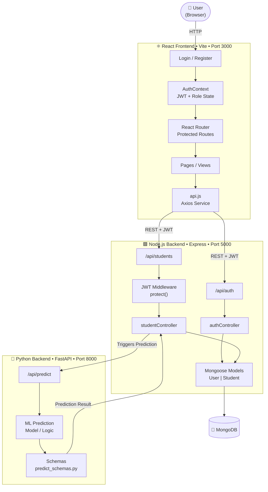
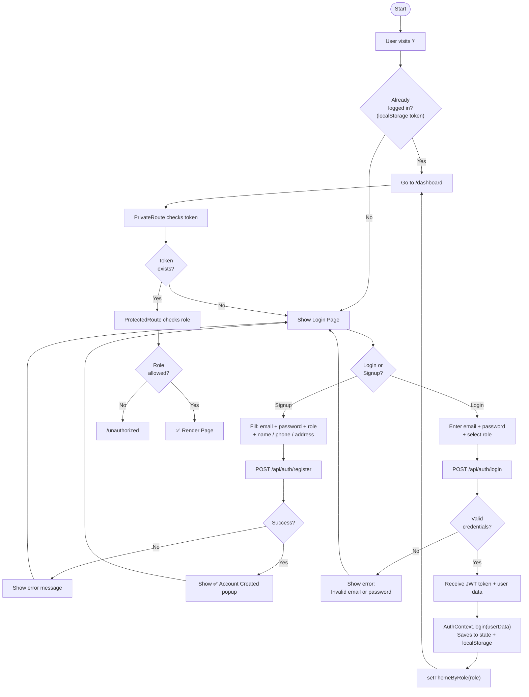
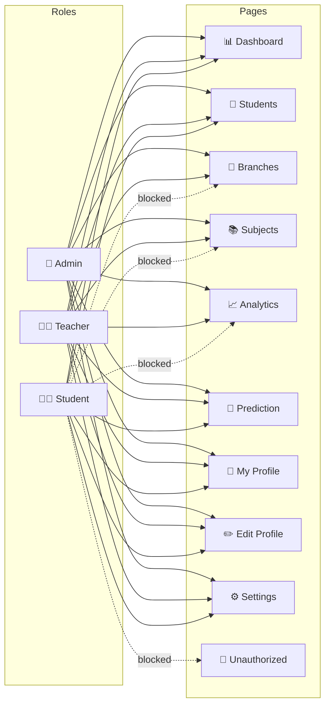
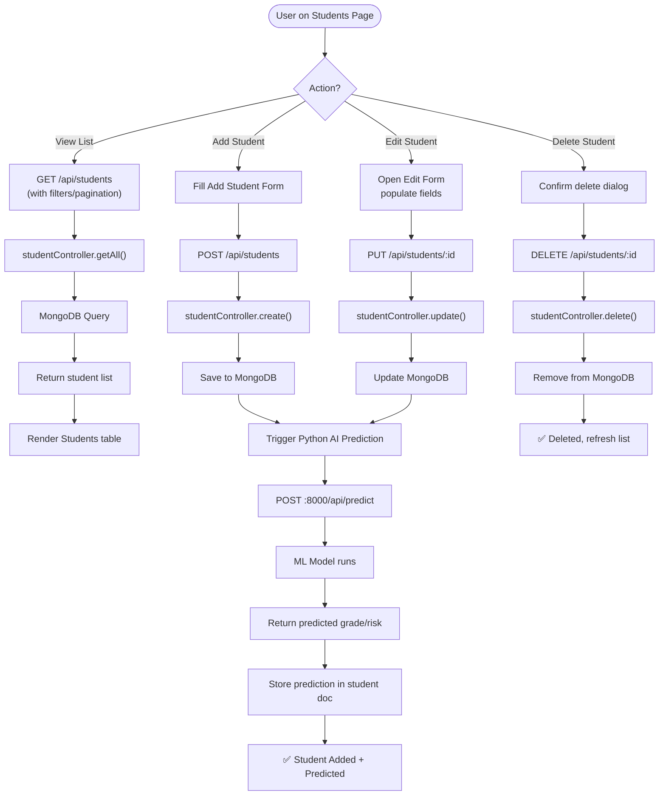
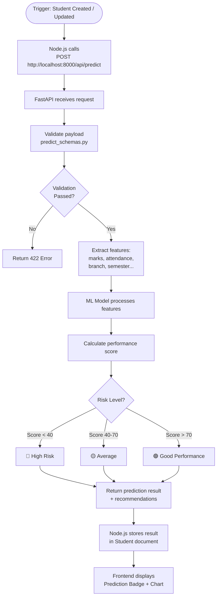
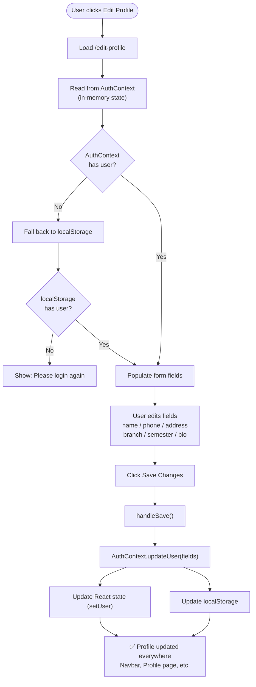
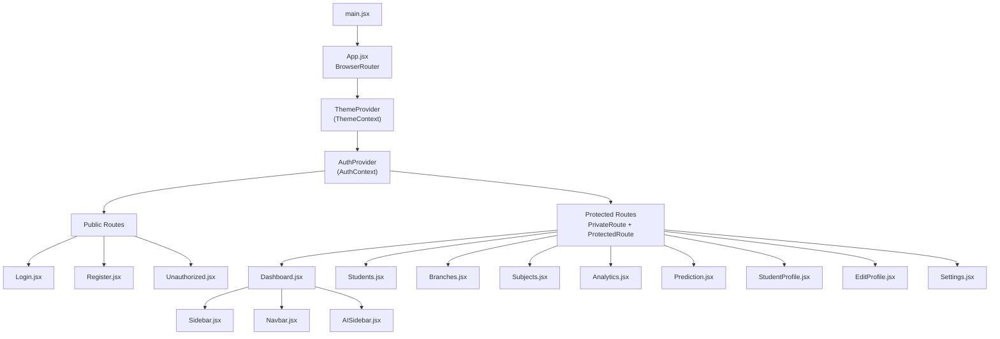
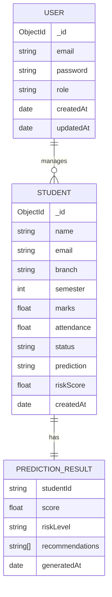

# 🎓 Student Performance Prediction — Project Flowchart

---

## 1. Overall System Architecture

---

## 2. Authentication Flow

---

## 3. Role-Based Access Control (RBAC)

---

## 4. Student Data CRUD Flow

---

## 5. AI Prediction Flow

---

## 6. Profile Edit Flow

---

## 7. Frontend Component Tree

---

## 8. Data Models

---

## 9. Tech Stack Summary

| Layer | Technology | Port |
|-------|-----------|------|
| **Frontend** | React + Vite + React Router | 3000 |
| **Styling** | TailwindCSS + React Icons | — |
| **State** | AuthContext + StudentContext | — |
| **HTTP Client** | Axios (api.js) | — |
| **Node Backend** | Express.js + JWT + bcrypt | 5000 |
| **Python Backend** | FastAPI + Uvicorn | 8000 |
| **Database** | MongoDB + Mongoose | 27017 |
| **Auth** | JWT Bearer Token | — |
| **AI/ML** | Python ML Model (FastAPI) | 8000 |
